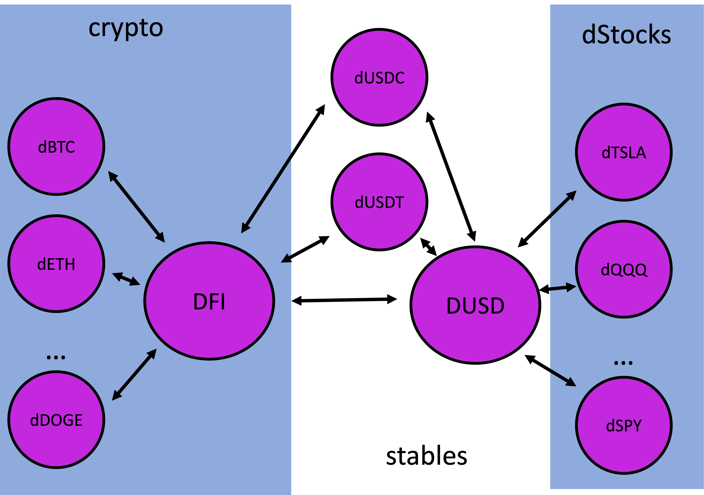

## DEX and decentral trading

_What is „the DEX“ and how does it enable trading?_

DEX is short for decentral Exchange and describes the feature on the DefiChain that enables the trading of dTokens. Other than on a central exchange (CEX) there is no orderbook managed by a central entity. The trades are handled via trading pools instead. Such a pool is filled with two types of assets. The ratio between the amount of those assets in the pool results in the price of the assets. The exchange rate gets more or less calculated from this ratio.

## Trading Pools

On the DeFiChain you can distinguish between crypto- und dStock-pools.

The crypto-pools always trade with DFI, the native coin of the DeFiChain, e.g. dETH-DFI or dBTC-DFI. A subcategory of that are the stablecoin pools dUSDT-DFI and dUSDC-DFI.

The dStock-pools on the other hand, always trade with DUSD, the stablecoin of the DeFiChain. E.g. sTSLA-DUSD, dQQQ-DUSD, and so on. Also the DUSD can be traded directly with the stablecoins - dUSDT-DUSD and dUSDC-DUSD. A list of the dStocks grouped by asset categories: [Tradable dAssets on DeFiChain](./Tradable_dAssets_on_DeFiChain.md)

One pool combines the two worlds: DFI-DUSD

## Liquidity Mining

You can participate in the trading pools and provide liquidity. For that you have to own both assets and add them to the pool with the same value of asset A and asset B, for example dTSLA and DUSD both for a value of 100$. The amount of the pool that you participate in gets added to your wallet as a separate pool token. Block by block you will now receive rewards (in DFI) and a part of the exchange fees (commission in the asset that got swapped).

A risk one has to consider when providing liquidity to a pool (meaning to do liquidity mining) is the [Impermanent Loss](./Impermanent_Loss.md).
