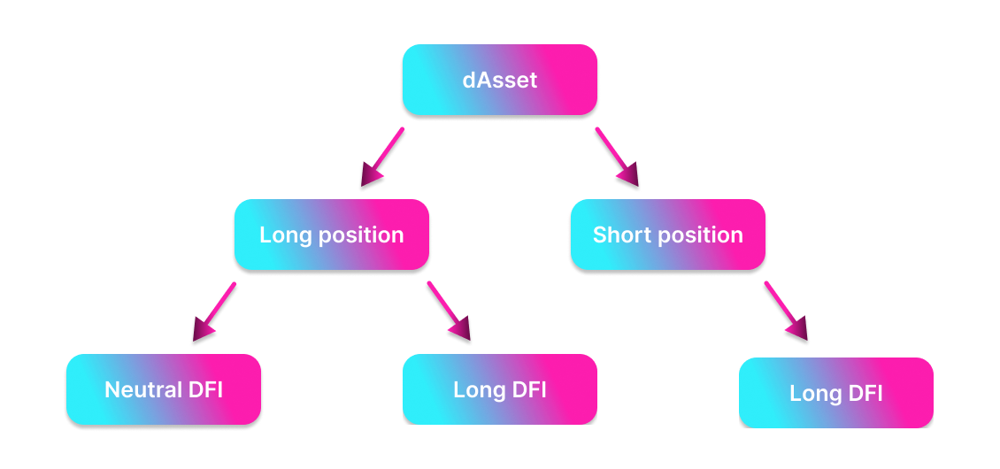

**This page was not fully converted yet to the new wiki format. Coming soon!**

You can find previous version of this page here: https://defichain-wiki.com/wiki/Investing_%26_Trading_with_Decentralized_Loans_and_Assets_on_DeFiChain

## Part 1: Long and short positions with stock token {#part-1}

With decentralized loans and assets on DefiChain, you can invest in different assets betting on increasing (long) or decreasing (short) prices. We will explain 3 different ways of investing.

### Long position - Neutral DFI

#### Investment thesis

The future price of an asset will be higher than it is today.

#### DefiChain procedure

- Sell DFI on DEX for DUSD
- Buy your preferred asset on DEX with **x amount** of DUSD
- Goal in the future
  - Sell asset for **y amount** of DUSD
  - Profit: **(y-x) DUSD**

#### Remarks

- Trades and profit are in DUSD
- DEX prices are relevant for the trade, not the price feed **→ pay attention of the pool ratio**
- Any price movement of DFI will not have an effect on your investment
- Step 1 and 2 will be combined to a composite swap, which is only one step for the user
- Your complete capital is invested

#### Example

With a DFI price of $2.50 you sell 280 DFI, and receive 700 DUSD. You buy 1 TSLA for those 700 DUSD and hold it.

After some time the TSLA price rises to 1000 DUSD and the DFI price to $4.00. Selling TSLA for DUSD gives you 1000 DUSD and you make 300 DUSD profit.

#### Remark

If you want to go back to DFI you will receive 250 DFI for the 1000 DUSD, because the price went up to $4.00.

**→ The best case for this investment: The asset price increases**

### Long position - Long DFI (leverage)

#### Investment thesis

The future price of an asset and DFI will be higher than it is today.

#### DefiChain procedure

- Put some coins (e.g. DFI) up as collateral for a decentralized loan and mint DUSD.
- Buy your preferred asset on the DEX with **x amount** of DUSD
- Goal in the future
  - Sell the asset for **y amount** of DUSD
  - Close a loan by putting tokens + interest back
  - Profit: **(y-x) DUSD - interest**

#### Remarks

- Trades and profits are in DUSD.
- DEX prices are relevant for trades, not the price feed. **→ pay attention to the pool ratio**
- Getting your DFI amount back in step 4 is the same as in step 1. **→ you open a long position on DFI**
- Not all your capital is invested (2/3 – 1/10 with respect to loan collateral). **→ reduced yield for long position on asset**
- You will have a liquidation risk, if the price of your collateral falls too low.

#### Example

With a DFI price of $2.50 you put 280 DFI into a decentralized loan. For the value of $700 you get 350 DUSD (200% collateralization). You use this DUSD to buy 0.5 TSLA on DEX.

After one year TSLA price goes up to $1000 and DFI price up to $4.00. Now you sell the 0.5 TSLA for 500 DUSD. With 357 DUSD (350 DUSD plus 7 DUSD interes) you can close your loan and made 143 DUSD profit.

You also receive back your DFI, which are now $1120 worth and made an additional profit of $ 420. Your DFI long position was right.

**→ The best case for this investment: Asset price increases and DFI price increases**

### Short position - Long DFI

#### Investment thesis

The future price of an asset will be lower than it is today.

#### DefiChain procedure

- Put some coins (e.g. DFI) as a collateral into a decentralized loan and mint a decentralized token (e.g. TSLA token).
- Sell the token on the DEX and get **x amount** of DUSD from selling.
- Goal in the future
  - Buy token + fee back with **y amount of DUSD** (from holding)
  - Close loan by putting token + interest back
  - Profit: **(x-y) DUSD - interest**

#### Remarks

- Asset trades and profits are in DUSD.
- DEX prices are relevant for the trade, not the price feed. **→ pay attention to the pool ratio**
- Putting your DFI amount in vault as a collateral means, that **you open a long position on DFI.**
- Not all your capital is invested (2/3 – 1/10 with respect to loan collateral). **→ reduced yield for short position on asset**
- You will have a liquidation risk if the price of your collateral falls too low.

#### Example

With a DFI price of $2.50 you put 280 DFI into a decentralized loan = $700. For the value of $700 you get 0.5 TSLA (200% collateralization and TLSA price of $700). You sell this 0.5 TSLA on DEX and get 350 DUSD.

After one year the TSLA price decreased to $500 and the DFI price increased to $4.00. Now you buy back the 0.5 TSLA for 250 DUSD and 0.01 TSLA for 5 DUSD (interest). With 0.51 TLSA you can now close your loan and make 95 DUSD profit.

You also receive back your DFI, which are now worth $1120 and you make an additional profit of $ 420. Your DFI long position was the right choice.

**→ The best case for this investment: The Asset price decreases and DFI price increases!**
