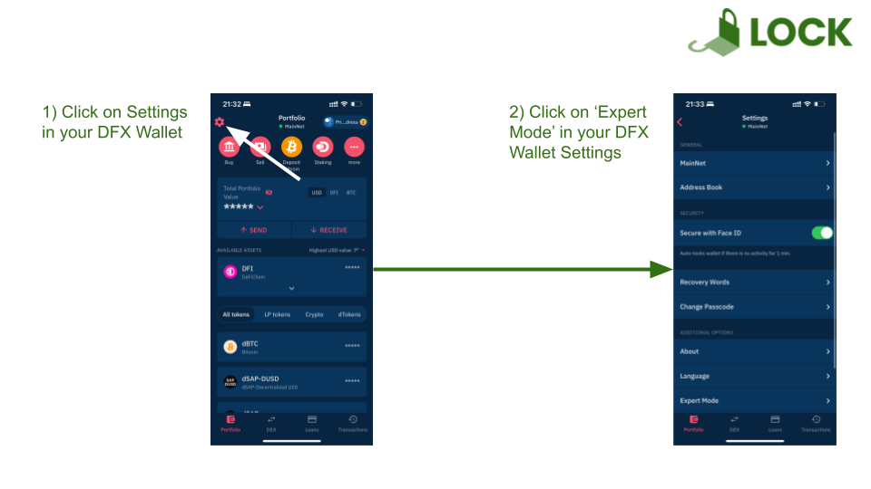
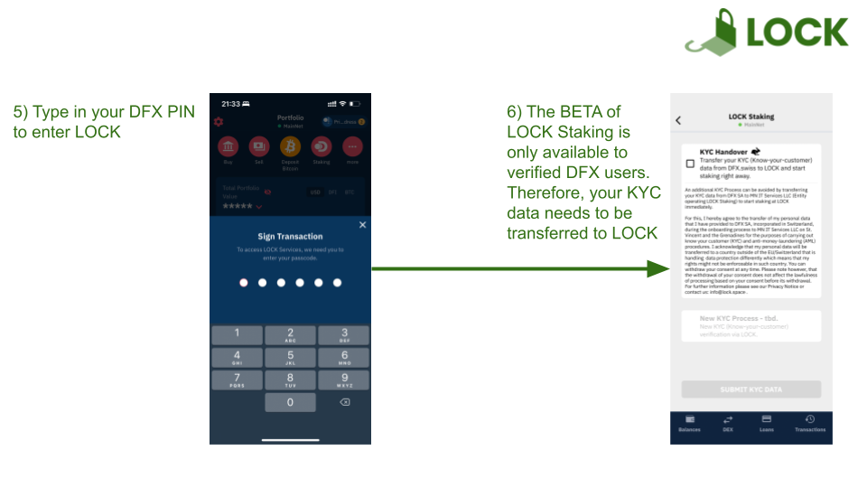
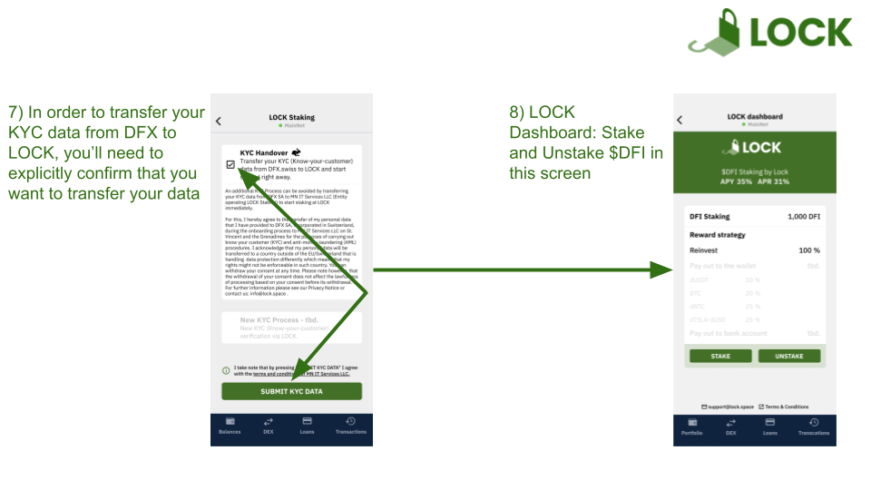
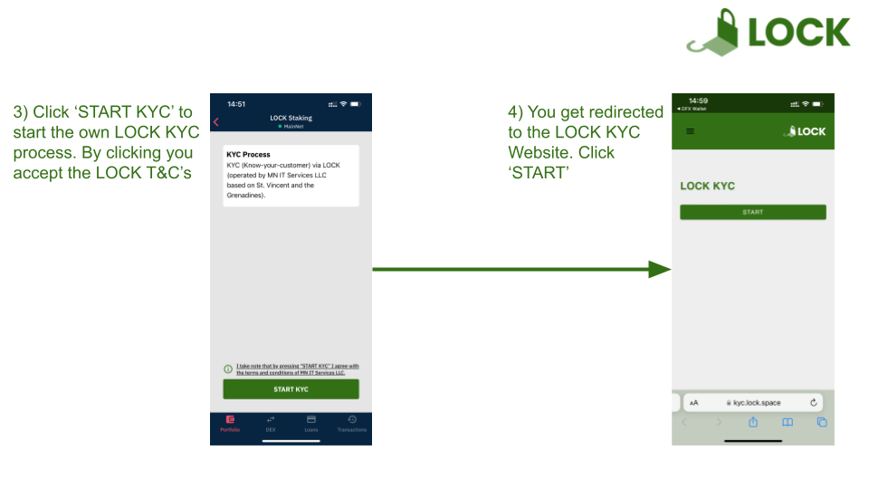
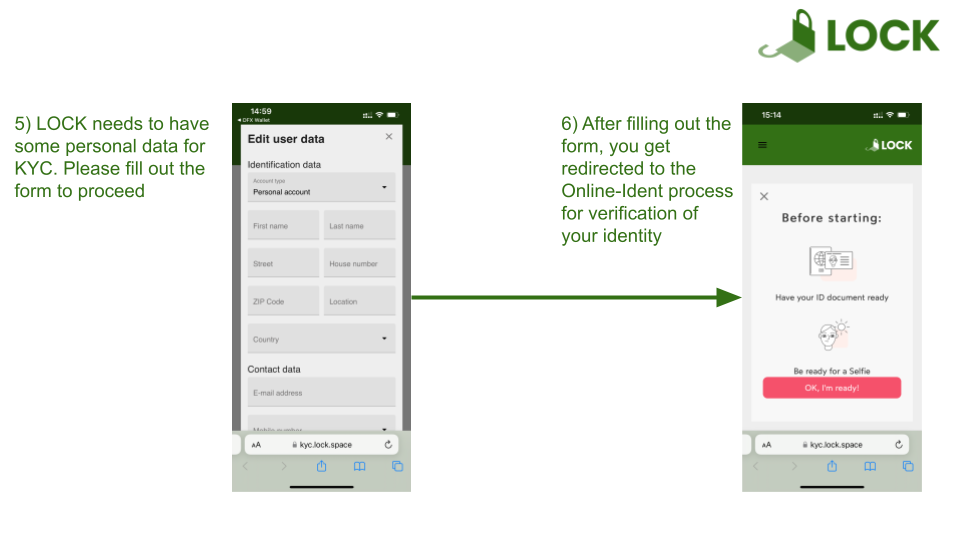
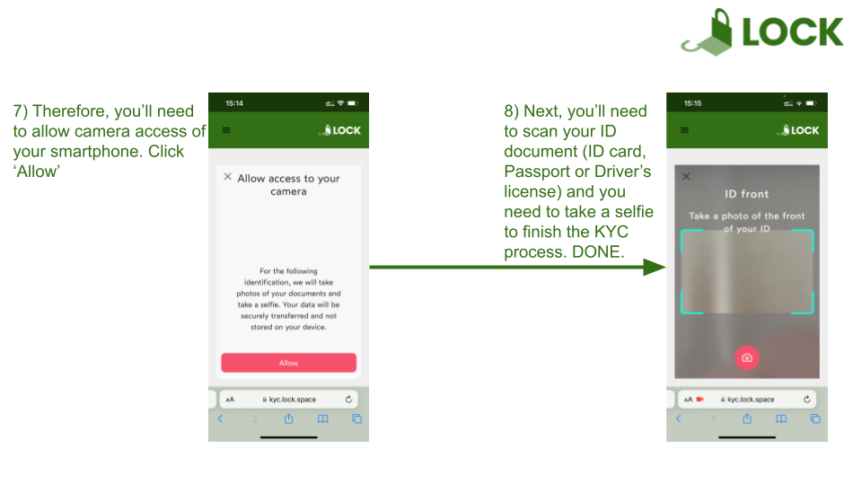

This page contains the most frequently asked questions about LOCK.space. Please note that this page is a community page maintained by the community and not by LOCK itself.

## FAQ

### What is LOCK?

LOCK is a new, independent and global Staking provider to further decentralize DeFiChain and enable a better governance. LOCK provides Staking services to retail as well as institutional investors and is available in different wallets like DFX or Jellywallet. Further wallets will be integrated LOCK Staking in future as well.

### How does LOCK Staking work?

LOCK Staking is integrated natively in wallets like DFX or Jellywallet. DFI Coins (DFI UTXO) can be transferred directly into LOCK Staking within the LOCK application in order to receive Staking rewards onto your wallet address. Your KYC data can be transferred from DFX to LOCK, if you’re a customer at DFX. Otherwise LOCK offers an own KYC process (in V2).

### When can I unstake my DFI?

You can stake and unstake your DFI anytime. Usually, you receive your DFI within 5 min after unstaking. For further information, please have a look at our [Terms & Conditions](https://lock.space/terms/).

### What is the fee structure of LOCK?

Final Staking fees are not yet dicsclosed, but there will be no fees in 2022.

### Who is operating the Masternodes?

Masternodes are run by LOCK and the custody of DFI is done by LOCK as well. The operator nodes, however, are operated by the [mydeficha.in](https://mydeficha.in/en/index.php?site=masternodes) in order to guarantee a Masternode uptime of \~99%.

### Can Staking rewards be paid out in different assets?

The standard asset for Staking rewards is DFI (V1) which will be reinvested automatically. eUsers will be able to choose their assets of the paid out Staking rewards on a percentage basis in V2. For instance, it will also be possible to receive Staking rewards in different tokens like dBTC, dETH, etc. as well as in stablecoins (e.g. dUSDT, dUSDC) and/or liquidity tokens (e.g. dUSD-dTSLA). Furthermore, Staking rewards can be paid out in native Bitcoin.

### How are the funds secured?

LOCK has a sophisticated security set-up in which no single person can withdraw any customer funds. More details are not public in order to protect customer funds.

### How is DeFiChain voting taking place?

Any LOCK user is able to vote on CFPs/DFIPs regardless of the amount of staked DFI. Any user can vote YES/Neutral/NO on each CFP or DFIP. The LOCK Masternodes vote pro rata following the will of LOCK users.

### Is there Staking planned for other Blockchains/Protocols?

Yes, LOCK will integrate further Staking protocols for its users in future.

## Enabling LOCK Staking - STEP-by-STEP Guide

## LOCK KYC Process - STEP-by-STEP Guide

