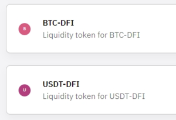
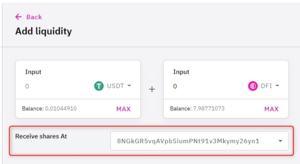
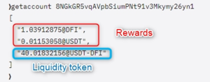
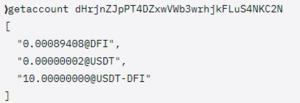
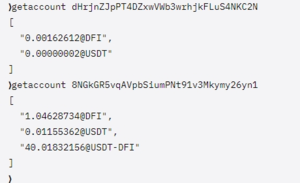
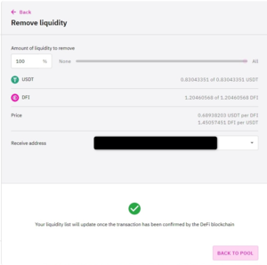

If you provide liquidity in one of the pools on u/defichain you will see liquidity tokens in your wallet. Many users have questions regarding this token, which I try to answer here.

## Providing liquidity {#providing-liquidity}

If you want to join a liquidity pool you have to put 2 coins of the selected pool-pair with the current ratio. The coin prices are not relevant, even though most of the people think in fiat money (dollar value).So, let assume the current ratio is:

r = CoinA_overall / CoinB_overall and CoinB is DFI.

For a amount of y DFI you have to provide from CoinA the amount x = r \* y.

So, for giving the coin amounts x and y into the pool you will get liquidity token as your share. If you leave the pool later, these token will be paid out with the ratio given at that moment.The tokens will be transferred to the address you define by joining the pool (see picture). Later all rewards from your pool share will also be deposited to this address.

The calculation of the token number can be approximated by the following formula: LP_token = sqrt ( x \* y )

*Example: I invested 3.9842 DFI + 2.5 USDT in the liquidity pool and got 3.1571 USDT-DFI liquidity token.With the sqrt formula above it should be 3.1561, so there is a small deviation below 0,1%.*

The rewards are based on the holding of the liquidity token in your wallet. For one pool you are getting the ratio of yourLPToken / overallLPToken (this figure is shown as "Share" in your wallet) of the overall rewards (in the corresponding pool). The total amount of Liquidity token can be seen using the DEX-API.

Parameter totalLiquidity: <https://api.defichain.io/v1/listpoolpairs?start=0&limit=500&network=mainnet&including_start=false> There is also an evaluation of the Liquidity token amount under: <https://www.cakedefi-review.com/DefiChain?tab=DEXLT>

This is all you have to know, if you just want to provide liquidity and get rewards.

## Advanced handling of Liquidity token {#advanced-handling-of-liquidity-token}

Now we have a deeper look into the background. In the above section we chose an address for holding the liquidity token. If you don't remember it, use the command

`listaccounts {} false false true`

to get a full list of your addresses and holdings. In the console you can now have a look on the address holding the liquidity token with

`getaccount address_holding_LPtoken`

These token can be send like any other token on Defichain. I just created a new, empty address (see picture)

On this address I want to deposit 10 of my USDT-DFI liquidity token. Therefore choose the corresponding wallet (here USDT-DFI) and select the send function. Put in the amount of token and the address. That's it.

After the next block, the token are transferred and after a few more blocks, you see the rewards coming for these liquidity token. Now I have two addresses holding the same liquidity token. If I want to get them together on a single address there are 2 options:

1.  The GUI sending function has no option for choosing the withdraw address. So I have to send all my USDT-DFI token to a new address, to ensure that the right ones are moved.
2.  Using a console command for sending the token with definition of a source address.

Just to make this complete, here the example of using the console. The relevant command is

`sendtokenstoaddress {"source_address":"token_amount@token_symbol"} {"destination_address":"token_amount@token_symbol"}`

If you got an error regarding finding UTXO's for owner, then you need to send some DFI first (have a lock on the screenshot). After this procedure all USDT-DFI token are on the same address, before I started this small tutorial

Now, you have learned, that you can also send the liquidity token to new addresses and that the owner of this address will get the rewards. This should not be needed, but can be helpful in special cases.

I also have send 1 USDT-DFI liquidity token to a complete other wallet, which had no liquidity token. In this wallet the liquidity token leads to a pool share (as expected) and the other user could convert this pool share (or better liquidity token) back to USDT and DFI.
