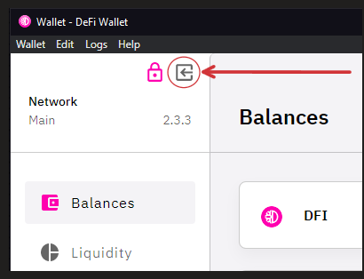

Upfront information: At the time this article was created the latest version of the DeFiChain app is 2.3.0. The article was updated for version 2.5.2.

#### Introduction {#introduction}

There are several scenarios where you might want or need to restore your wallet. Examples are a complete computer reinstall with reinstall of DeFiChain app, an installation of the DeFiChain app on a second computer or a virtual machine for redundancy. The restore process has improved with version 2.3.0 and higher of the app and offers better guidance among different possibilities.

In general you can restore from a

- .dat file (which is the underlying file format the wallet data is stored in or backup to) or a
- recovery seed (aka mnemonic seed, seed phrase, 24 words, ...).

If you restore from a .dat file be aware that this file needs to stay at it's location since the app is keeping to use it. The current .dat file the app is using is configured in the defi.conf file. If you're unsure which .dat file is currently used, please check defi.conf. Moving, changing or removing a .dat file that is currently used by the app causes problems.

The recovery seed is only for users who created the wallet in older app versions than 2.3.0. There are many problem with recovery seed and wallet encryption as described [here](./Wallet_Encryption.md).

It may take some minutes after the restore until your funds and assets are completely visible. You might miss receiving addresses after restore. You can add them manually if you stored them somewhere (described [here](./Create_address.md#Display_an_old_address_again)).

#### Scenario 1: Wallet created in 2.3.0 or higher, password is set, .dat file available {#scenario-1-wallet-created-in-230-or-higher-password-is-set-dat-file-available}

Select "Restore wallet from backup" from the app's start page. Keep in mind that your app needs to be synced before restoring can be started. Choose the .dat file you want to restore from.

*Note: If you do not see an option to "Restore wallet from backup" within the app, you can click the arrowed box icon in the upper left portion of the app. This will allow you to exit the current wallet and remove it from the app. The node restarts and you will now have an option to restore the wallet from backup.*

#### Scenario 2: Wallet created before 2.3.0, recovery seed available, no password set {#scenario-2-wallet-created-before-230-recovery-seed-available-no-password-set}

Select "Restore wallet from recovery seed". Enter the 24 words.

#### Scenario 3: Wallet created before 2.3.0, recovery seed available, password set {#scenario-3-wallet-created-before-230-recovery-seed-available-password-set}

Setting the password enables wallet encryption. As described [here](./corrupt_salvage_failed.md), a full recovery from the seed phrase is no longer possible and a .dat file is required for full restore. The seed phrase works in general but it can only restore private keys, public keys and addresses that have been created <u>before</u> encryption was enabled, i.e. the password was set.

So if you have .dat file available restore from it as in scenario 1, if not cross your fingers and restore as in scenario 2.

#### Scenario 4: Wallet created before 2.3.0, recovery seed available, password set, .txt backup available {#scenario-4-wallet-created-before-230-recovery-seed-available-password-set-txt-backup-available}

In older versions, backups of the wallet have been stored in .txt format by the app. These .txt backup are unencrypted and contain sensitive information such as your private keys. If you stored them somewhere remember to keep them very safe! Of course you need to remember your password in that case.

To restore you need to use the command line of the app. Type the command

`importwallet `*`<complete path to your .txt file>`*

so e.g. `importwallet c:\Users\toni\documents\defi_backup.txt`
