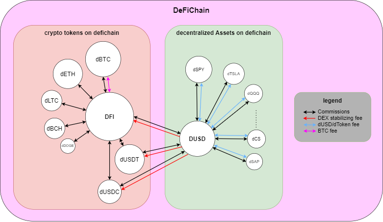
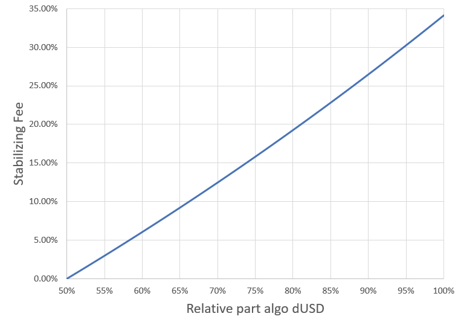

Wenn Du Token auf DeFiChain tauschst, wird eine Gebühr erhoben. Am Anfang war nur der Teil für Liquiditätsanbieter – Provisionen – die Gebühr in jedem Pool. Aber nach erfolgreicher Abstimmung über mehrere DFIPs wurden andere Gebührenteile für bestimmte Zwecke eingeführt. Dieser Artikel beschreibt die aktuelle DEX-Gebührenstruktur auf DeFiChain.

## Gebühren {#fees}

### Überblick {#overview}

Das folgende Diagramm zeigt die verschiedenen Pool-Swaps (Tasuch) auf DeFiChain. Generell fällt für jeden einzelnen Swap eine Provision an (schwarze Pfeile). Hinzu kommen die DEX-Stabilisierungsgebühr (roter Pfeil), die BTC-Gebühr (lila Pfeil) und die dUSD/dToken-Gebühr (blauer Pfeil). Kurz zusammengefasst:

- Provisionen: 0,2 %
- dBTC-Gebühr: 0,1 %
- DUSD/dToken-Gebühr: 0,2 %
- DEX-Stabilisierungsgebühr: 0...~34% (in Abhängigkeit des Algo-dUSD-Anteils)

*DeFiChain DEX-Swaps und Gebühren*  


### Kommisionen / Provisionen {#commissions}

Die Kommissions- oder Provisionsgebühr beträgt derzeit 0,2 % und wird von den Token abgezogen, die Benutzer auf dem DEX tauschen möchten. Diese Token werden an die Inhaber des Liquiditätstokens verteilt und sind Teil des Anreizes, Liquidität bereitzustellen. Die Provisionsgebühr ist der gleiche Gesamtpool auf DeFiChain - Krypto und dToken.

Auf [defiscan.live](https://defiscan.live/dex) kannst du den effektiven Jahreszins jedes Pools sehen und wenn du mit der Maus über die drei blauen Punkte fährst, wird die Verteilung zwischen Blockbelohnungen und Provisionsanteil angezeigt. Hohe Handelsvolumina (z. B. in volatilen Marktphasen) werden den Provisionsteil antreiben.

*Defiscan zeigt den effektiven Jahreszins, aufgeteilt in Blockbelohnung (Rewards) und Provisionsteil (Commissions)*  


### DEX stabilizing fee {#dex-stabilizing-fee}

Die DEX-Stabilisierungsgebühr hängt vom relativen Anteil des Algo-dUSD-Tokens auf DeFiChain ab. Unter 50 % beträgt diese Gebühr 0 % und erhöht sich bei Werten über 50 % (siehe Grafik unten).

*DEX Stabilisierungsgebühr*  


Die Formel hinter dieser Abhängigkeit lautet:

``` python
Let ALGO_DUSD_RATIO = 1 - (Loan DUSD / total DUSD supply)
Let COEFFICIENT = 1.8
If ALGO_DUSD_RATIO > 0.5
   DEX stabilization fee = (COEFFICIENT ^ (ALGO_DUSD_RATIO - 0.5)) - 1
Else
   DEX stabilization fee = 0%
```

Mit zunehmender Stabilisierungsgebühr werden wir eine Prämie für DUSD auf DeFiChain sehen, da der Verkauf von dUSD immer teurer wird. Wenn du DUSD im Premium-Fall kaufst, erhältst du weniger DUSD als den von dir investierten Dollarwert. Und das macht das Prägen (minten) von DUSD über Tresore (vautls) und Kredite (loan) attraktiver.

### DUSD/dToken Gebühr {#dusddtoken-fee}

Mit der Einführung der DFI-Payback-Funktion für DUSD-Darlehen wurde eine zusätzliche Gebühr von 0,1 % in DUSD für jeden Swap mit DUSD eingeführt, siehe [DFIP-2112-A](https://github.com/DeFiCh/dfips/issues/99). Dies war die erste Maßnahme, um den Algo DUSD nach Schließung der entsprechenden Kredite zu entfernen.

Mit dem [DFIP-2203-A](https://github.com/DeFiCh/dfips/issues/127) wurden Futures Swaps zur Abwicklung des Auf- und Abschlags der dTokens eingeführt. Im selben DFIP wurde eine in den dTokens bezahlte Gebühr von 0,1% aktiviert.

Beide Teile (in Summe 0,2%) werden nun für jeden DUSD-dToken-Pool aufgebracht und ergeben eine Gesamtgebühr von 0,4% für einen Swap mit dTokens. Der DUSD-DFI hatte am Anfang auch die 0,1%, hat aber aufgrund neuerer DFIPs jetzt eine andere Gebührenstruktur (siehe [DEX Stabilisierungsgebühr](#dex-stabilizing-fee)).

### BTC Gebühr {#btc-fee}

In der ersten Version des Atomic-Swap auf DeFiChain gab es einen Fehler und ein oder mehrere Benutzer nutzten ihn aus, um dBTC zu erstellen. Normalerweise ist CakeDefi das Gateway für die Krypto-Assets auf DeFiChain und sie legen den nativen Coin beim Minten (Prägen) von dTokens auf eine öffentlich bekannte Adresse der entsprechenden Blockchain. Die dBTC aus diesem Exploit wurden ohne Sicherheiten geprägt und die Community beschloss, Mechanismen einzuführen, um sie über einen längeren Zeitraum aus dem System zu entfernen. Weitere Details findest du im entsprechenden [DFIP](https://github.com/DeFiCh/dfips/issues/101).

Ein Teil ist eine zusätzliche Gebühr für die Nutzung des dBTC-DFI-Pools. Von jedem Swap wird eine Gebühr von 0,1 % als dBTC abgezogen und verbrannt. Die Gesamtgebühr dieses dBTC-DFI-Pools beträgt: 0,3 %
